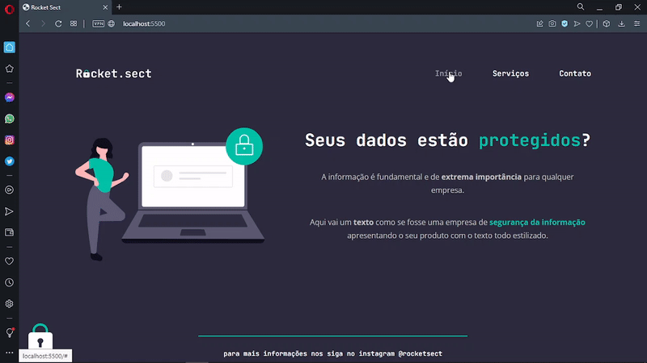
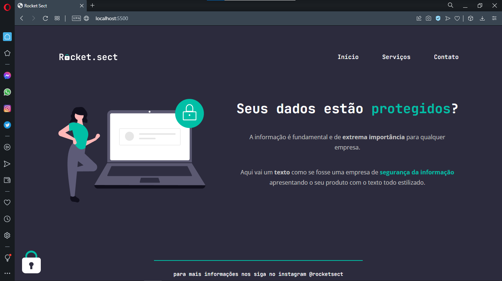

# Rocket Sect

<h1 align="center">
    
</h1>

<br>

### 💻 Rocket Sect

The challenge of this one is to build a web page from scratch using the layout of 
the prototype available on figma, strengthen my knowledge of HTML and CSS in applying 
concepts and what was seen in previous Stage 2 projects.
I went further and challenged myself to apply concepts that were not observed in 
classes and projects when applying responsiveness on the web page.

Watch it in action Deploy: [Click Here](https://felipe-gomes-vicente.github.io/rocket-sect/)

What was developed:

- Structuring HTML with semantic tags;
- I challenged myself and applied Responsiveness;
- Position of elements on the screen;
- Import external CSS file into the project;
- Applying custom fonts (typography) in the CSS file and starting the external CSS;
- Working with colors and fonts;
- Aligning and positioning texts and elements;
- Applying the spacing;
- Borders and element classifications;
- The CSS Box Model concept;
- Use CSS variables to manipulate the project's color palette;
- Hover effect on HTML elements of links;
- Reset CSS removing possible inconsistencies between different browsers;
- Project file system structure separated by folder;


I applied my knowledge of the Explorer from Rocketseat concepts in a practical way 
to this project, with the lessons:

- Introduction to HTML and CSS;
- Getting to know new concepts of HTML and CSS;
  
<br />

- [EXPLORER - Rocketseat](https://www.rocketseat.com.br/explorer)
- [Print Figma - Rocket Sect](https://www.figma.com/file/EdKjPWjC8ZlbnH4XzTObv2?node-id=16:106)

## IImage from the final project:
 


## 🧪 Tools

Application developed using the following tools:

- [HTML5](https://www.w3schools.com/html/default.asp)
- [CSS3](https://www.w3schools.com/css/default.asp)

## 🚀 Getting started

Live server with VScode or just clone folder and access index.html

### Programs needed to Getting started

- [Live Server (Opcional)](https://marketplace.visualstudio.com/items?itemName=ritwickdey.LiveServer)
- [Visual Studio Code - Vscode](https://code.visualstudio.com/)

Clone the project and access the folder.

```bash
$ git clone https://github.com/felipe-gomes-vicente/rocket-sect.git
$ cd rocket-sect
```

## 📝 License

This project is under the MIT license. See the file [LICENSE](LICENSE.md) for more details.

---

&nbsp;

<p align="center">Done with 💜 by Felipe Vicente👋</p>

- ## My LinkedIn - [](https://www.linkedin.com/in/felipe-gomes-vicente/)
